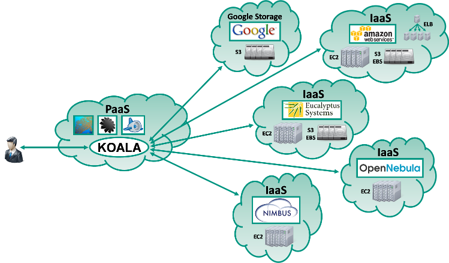

# KOALA Cloud Manager

KOALA (Karlsruhe Open Application (for) cLoud Administration) is a software service, designed to help you working with your [Amazon Web Services](http://aws.amazon.com) (AWS) compatible cloud services and infrastructures (IaaS). The public cloud services from Amazon and the HP Cloud (that offering is now defunct!) are support as well as private cloud services based on [Eucalyptus](https://github.com/eucalyptus/eucalyptus), [Nimbus](https://github.com/nimbusproject/nimbus) or [OpenNebula](https://github.com/OpenNebula/one). The storage services [Google Cloud Storage](https://cloud.google.com/storage/), [Dunkel Cloud Storage](https://www.dunkel.de/s3) and Host Europe Cloud Storage (that offering is now defunct!) can be used with KOALA too

KOALA helps interacting with cloud services that implement the APIs of 

- [Elastic Compute Cloud](http://aws.amazon.com/ec2/) (EC2) 
- [Simple Storage Service](http://aws.amazon.com/s3/) (S3)
- [Elastic Block Store](http://aws.amazon.com/ebs/) (EBS) 
- [Elastic Load Balancing](http://aws.amazon.com/elasticloadbalancing/) (ELB)

With KOALA the users can start, stop and monitor their instances, volumes and elastic IP addresses. They can also create and erase buckets inside the S3-compatible storage services S3, Google Storage and Walrus. It's easy to upload, check and modify data that is stored inside these storage services, the same way it can be done with [S3Fox](http://www.s3fox.net) and the [Google Storage Manager](https://sandbox.google.com/storage/).

KOALA itself is a service that is able to run inside the public cloud platform (PaaS) [Google App Engine](http://appengine.google.com) and inside Private Cloud platforms with [AppScale](https://github.com/AppScale/appscale) or [typhoonAE](http://code.google.com/p/typhoonae/).

**A customized version for Android and iPhone/iPod touch devices is included.**

# Publications

- **The KOALA Cloud Manager - Cloud Service Management the Easy Way**. *Christian Baun, Marcel Kunze, Viktor Mauch*. Proceedings of the [IEEE Cloud 2011](http://www.thecloudcomputing.org/2011/index.html) 4th International Conference on Cloud Computing in Washington. ISBN:978-0-7695-4460-1
- **The KOALA Cloud Management Service - A Modern Approach for Cloud Infrastructure Management**. *Christian Baun, Marcel Kunze*. Proceedings of the 1st International Workshop on Cloud Computing Platforms ([CloudCP](http://www.wikibench.eu/CloudCP/)) that was part of the [EuroSys 2011](http://eurosys2011.cs.uni-salzburg.at) in Salzburg. The Association for Computing Machinery (ACM). ISBN:978-1-4503-0727-7

# How do I get started?

The [Wiki](https://github.com/christianbaun/koalacloud/wiki) provides instructions on how to use KOALA that runs as a service inside the Google App Engine with the most popular Cloud Services and how to install KOALA inside a Private Cloud PaaS.

**Web site of KOALA**: [http://koalacloud.appspot.com](http://koalacloud.appspot.com)

# Reason for the Development and Design Decisions

All existing tools to work with cloud services face several advantages and drawbacks.

- Online tools (software services) like the [AWS Management Console](http://aws.amazon.com/console/) and the [Google Cloud Console](https://console.cloud.google.com) are in line with just the cloud service offerings of the company. It is currently not foreseen to configure it in a way to e.g. work with services from an Eucalyptus private cloud infrastructure. [Ylastic](http://www.ylastic.com) offers support for most AWS cloud services and Eucalyptus infrastructures but it is not possible to work with other compatible infrastructures e.g. Nimbus. As the access keys are stored with the provider, the customer also has to trust the provider of the management tool regarding privacy and availability.
- Firefox browser extensions like [ElasticFox](https://sourceforge.net/projects/elasticfox/), [Hybridfox](http://code.google.com/p/hybridfox/) and [S3Fox](http://www.s3fox.net) only work with the Firefox browser and not e.g. Internet Explorer, Opera, Google Chrome or Safari. The customers have to install and maintain the management tool on their local computer, a fact that somehow does not reflect the cloud paradigm very well.
- Command-line tools like the AWS tools offered by Amazon only support the AWS public cloud offerings. The [Euca2ools](https://github.com/eucalyptus/euca2ools) from the Eucalyptus project and [GSUtil](https://cloud.google.com/storage/docs/gsutil) from Google support both, public and private cloud services. They require a local installation and lack ease of use as they implement no graphical user interface (GUI).
- Locally installed applications with a GUI like [ElasticWolf](http://www.elasticwolf.com), [EC2Dream](https://github.com/neillturner/ec2dream), [Gladinet Cloud Desktop](http://www.gladinet.com) and [Cyberduck](https://cyberduck.io) provide a better level of usability compared to command-line tools but not all applications run with every operating system and they require a local installation.

In order to improve the situation, KOALA has been developed as a flexible and open solution to satisfy all needs for the daily work with cloud services that comply to the AWS API.
